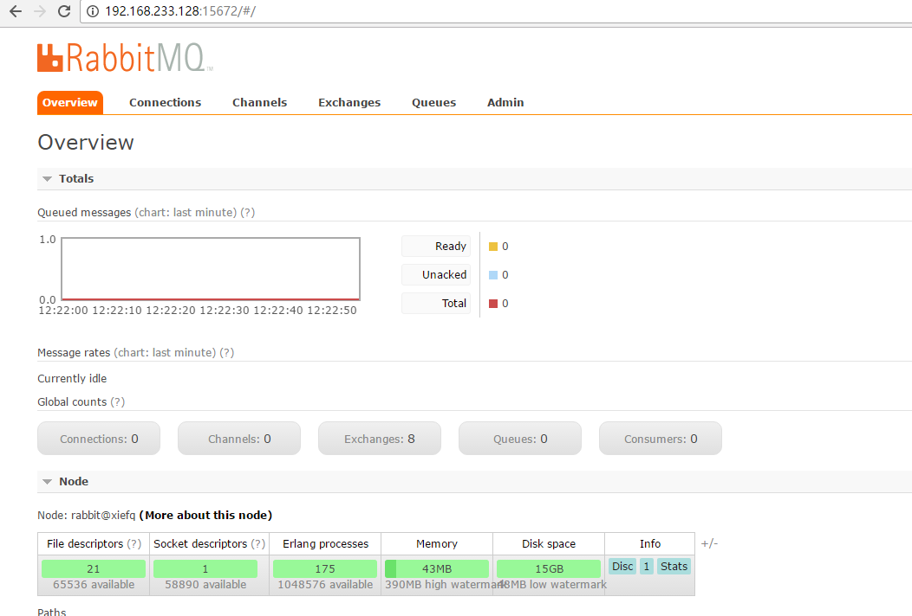

## RabbitMQ安装
如果是ubuntu，参考官网的APT安装方式。 参考 http://www.rabbitmq.com/install-debian.html
* APT方式安装快捷命令指南
```
//第一步：创建更新源
echo 'deb http://www.rabbitmq.com/debian/ stable main' | sudo tee /etc/apt/sources.list.d/rabbitmq.list
//第二步：防止中途告警提示
wget -O- https://www.rabbitmq.com/rabbitmq-release-signing-key.asc | sudo apt-key add -
//第三步：更新源列表
sudo apt-get update
//第四步：安装server
sudo apt-get install rabbitmq-server
```
* 启用管理插件
```
sudo rabbitmq-plugins enable rabbitmq_management
```
* ubuntu需要开启15672 和 5672 两个端口
```
sudo ufw allow 15672
sudo ufw allow 5672
```
* 增加管理账号
因为不知道管理账号的密码，所以自己创建一个管理账号  
```
rabbitmqctl add_user admin pwd
rabbitmqctl set_user_tags admin administrator
```

